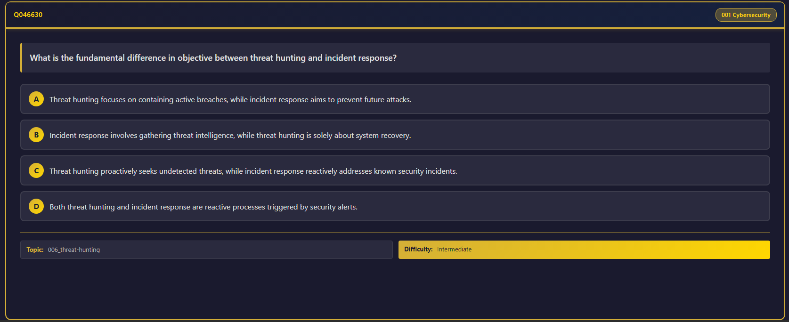
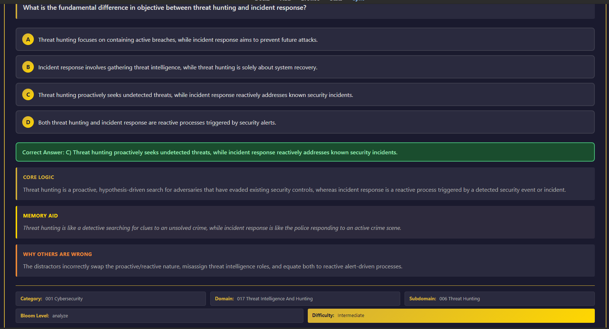
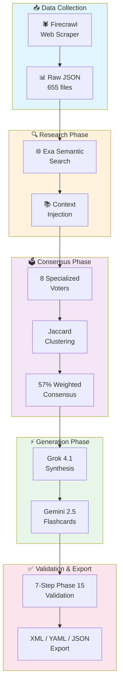

<p align="center">
  
</p>

# The Art of Language V2

   

[](https://instagram.com/devi.nws)

> "From Web Scraping to AI-Powered Learning Materials"

<p align="center">
  
  
  
  
  
</p>

---

## Highlights

- **139,403 curriculum topics** across cybersecurity, networking, and software engineering
- **8-voter AI consensus system** for pedagogical quality assurance
- **480,075+ validated flashcards** with Phase 15 quality protocol
- **GPU-accelerated deduplication** - 30.2% duplicate removal on H100 (480K → 335K)
- **Web-grounded research** via Exa semantic search and Context7
- **Production pipeline** processing 29 topics/minute

---

## Downloads (Anki Flashcards)

Ready-to-use Anki packages for the Cybersecurity curriculum. Import directly into [Anki](https://apps.ankiweb.net/).

<p align="center">
  
  
</p>

### Deduplicated
Semantically deduplicated using GPU-accelerated embeddings. 30.2% fewer cards with no redundancy.

| Domain | Cards | Size | Download |
|--------|-------|------|----------|
| Security & Risk Management | 60,462 | 25 MB | [Download APKG](https://storage.googleapis.com/flashcards-generations-learning/apkg/deduplicated/001_cybersecurity/001_security-and-risk-management.apkg) |
| Asset Security | 26,536 | 11 MB | [Download APKG](https://storage.googleapis.com/flashcards-generations-learning/apkg/deduplicated/001_cybersecurity/002_asset-security.apkg) |
| Cryptography | 35,286 | 15 MB | [Download APKG](https://storage.googleapis.com/flashcards-generations-learning/apkg/deduplicated/001_cybersecurity/005_cryptography.apkg) |
| Security Architecture | 46,630 | 19 MB | [Download APKG](https://storage.googleapis.com/flashcards-generations-learning/apkg/deduplicated/001_cybersecurity/007_security-architecture-and-engineering.apkg) |
| Software Dev Security | 32,159 | 13 MB | [Download APKG](https://storage.googleapis.com/flashcards-generations-learning/apkg/deduplicated/001_cybersecurity/008_software-development-security.apkg) |
| Application Security | 32,054 | 13 MB | [Download APKG](https://storage.googleapis.com/flashcards-generations-learning/apkg/deduplicated/001_cybersecurity/009_application-security.apkg) |
| Incident Response | 36,845 | 15 MB | [Download APKG](https://storage.googleapis.com/flashcards-generations-learning/apkg/deduplicated/001_cybersecurity/015_incident-response-and-forensics.apkg) |
| Penetration Testing | 32,704 | 14 MB | [Download APKG](https://storage.googleapis.com/flashcards-generations-learning/apkg/deduplicated/001_cybersecurity/016_penetration-testing-and-ethical-hacking.apkg) |
| Threat Intelligence | 32,438 | 14 MB | [Download APKG](https://storage.googleapis.com/flashcards-generations-learning/apkg/deduplicated/001_cybersecurity/017_threat-intelligence-and-hunting.apkg) |
| **Total** | **335,114** | **139 MB** | |

### Non-Deduplicated (Full Dataset - Recommended)
Complete flashcard set without deduplication.

| Domain | Cards | Size | Download |
|--------|-------|------|----------|
| Security & Risk Management | 97,005 | 38 MB | [Download APKG](https://storage.googleapis.com/flashcards-generations-learning/apkg/non-deduplicated/001_cybersecurity/001_security-and-risk-management.apkg) |
| Asset Security | 38,919 | 15 MB | [Download APKG](https://storage.googleapis.com/flashcards-generations-learning/apkg/non-deduplicated/001_cybersecurity/002_asset-security.apkg) |
| Cryptography | 50,301 | 20 MB | [Download APKG](https://storage.googleapis.com/flashcards-generations-learning/apkg/non-deduplicated/001_cybersecurity/005_cryptography.apkg) |
| Security Architecture | 66,749 | 26 MB | [Download APKG](https://storage.googleapis.com/flashcards-generations-learning/apkg/non-deduplicated/001_cybersecurity/007_security-architecture-and-engineering.apkg) |
| Software Dev Security | 45,427 | 18 MB | [Download APKG](https://storage.googleapis.com/flashcards-generations-learning/apkg/non-deduplicated/001_cybersecurity/008_software-development-security.apkg) |
| Application Security | 42,032 | 17 MB | [Download APKG](https://storage.googleapis.com/flashcards-generations-learning/apkg/non-deduplicated/001_cybersecurity/009_application-security.apkg) |
| Incident Response | 46,918 | 19 MB | [Download APKG](https://storage.googleapis.com/flashcards-generations-learning/apkg/non-deduplicated/001_cybersecurity/015_incident-response-and-forensics.apkg) |
| Penetration Testing | 38,259 | 15 MB | [Download APKG](https://storage.googleapis.com/flashcards-generations-learning/apkg/non-deduplicated/001_cybersecurity/016_penetration-testing-and-ethical-hacking.apkg) |
| Threat Intelligence | 54,465 | 22 MB | [Download APKG](https://storage.googleapis.com/flashcards-generations-learning/apkg/non-deduplicated/001_cybersecurity/017_threat-intelligence-and-hunting.apkg) |
| **Total** | **480,075** | **190 MB** | |

<details>
<summary><strong>Generation Details</strong></summary>

### Pipeline Configuration
| Parameter | Value |
|-----------|-------|
| Random Seed | `42` |
| Embedding Model | `all-mpnet-base-v2` (768 dims) |
| Similarity Threshold | `0.85` |
| Clustering Method | `threshold` |
| GPU | NVIDIA H100 80GB HBM3 |
| Precision | FP16 Mixed |
| Batch Size | 8192 |

### Reproducibility
All flashcards are generated with `--random-seed 42` for deterministic ordering. The deduplication pipeline uses cosine similarity with a 0.85 threshold to identify semantic duplicates.

### Deck Hierarchy
Cards are organized hierarchically:
```
001 Cybersecurity
  └── 017 Threat Intelligence And Hunting
        └── 006 Threat Hunting
              └── 001 Threat Hunting Fundamentals
                    └── Core Intelligence Components
```

### Generation Date
January 2026

</details>

---

## How It Works



---

## The Transformation Pipeline

<details>
<summary><strong>Stage 1: 🕷️ Web Scraping (Firecrawl)</strong></summary>

### What Happens
Firecrawl crawls educational websites and documentation to extract curriculum content.

### Output
- **655 JSON files** organized hierarchically
- **23.42 MB** of structured curriculum data
- Raw content with metadata and source URLs

### Data Structure
```
Category → Domain → Subdomain → Topics
```

</details>

<details>
<summary><strong>Stage 2: 📊 Data Structuring (Gemini 2.5 Flash)</strong></summary>

### What Happens
Google Gemini processes raw scraped content into hierarchical topic structures.

### Model Configuration
| Setting | Value |
|---------|-------|
| Model | `google/gemini-2.5-flash` |
| Temperature | 0.7 |
| Max Tokens | 3,000 |

### Transformation
```
Flat HTML Content → Hierarchical JSON
├── Category (3 total)
│   ├── Domain (47 total)
│   │   ├── Subdomain (355 total)
│   │   │   └── Topics (139,403 total)
```

### Cost
- $20.63 for complete dataset processing
- Average: 460.4 topics per file

</details>

<details>
<summary><strong>Stage 3: 🔍 Research Injection (Exa + Context7)</strong></summary>

### What Happens
Each topic is enriched with real-world sources via semantic search.

### Research Methods

| Method | Tool | Use Case |
|--------|------|----------|
| Semantic Search | Exa API | Neural search for authoritative sources |
| Web Plugin | OpenRouter | 70% cheaper, 10-20 topics/sec |
| Tech Docs | Context7 | Framework/library documentation |

### Output per Topic
- 8 ranked web sources
- Full text extraction
- Relevance scores
- Formatted citations

### Rate Limiting
- Exa: 4 requests/second (conservative)
- Web Plugin: 100 concurrent requests

</details>

<details>
<summary><strong>Stage 4: 🗳️ 8-Voter Consensus System</strong></summary>

### What Happens
8 specialized AI voters evaluate each topic from different pedagogical angles.

### The Voters

| Voter | Weight | Focus Area |
|-------|--------|------------|
| 🎓 **Pedagogy** | 1.2x | Bloom's Taxonomy, cognitive levels |
| 🎯 **Active Learning** | 1.0x | Student engagement, discussion |
| 🏗️ **Scaffolding** | 1.1x | Progressive complexity |
| 🔗 **Connection** | 1.0x | Cross-discipline linking |
| 📊 **Assessment** | 1.0x | Formative strategies |
| 💡 **Clarity** | 0.9x | Language accessibility |
| 📐 **Schema** | 0.8x | JSON structure validation |
| 🌐 **Exa Grounding** | 1.1x | Fact verification, sources |

### Model Configuration
| Setting | Value |
|---------|-------|
| Model | `x-ai/grok-4.1-fast` |
| Temperature | 0.7 |
| Max Tokens | 2,000 |
| Execution | Parallel (async) |

### Consensus Rules
- **Threshold**: 57% weighted approval required
- **Calculation**: `Sum(voter_weight × approval) / Sum(all_weights)`

</details>

<details>
<summary><strong>Stage 5: 🔀 Vote Aggregation (Jaccard Clustering)</strong></summary>

### What Happens
Voter suggestions are clustered and prioritized using Jaccard similarity.

### Algorithm
```
Similarity = |words_in_both| / |words_in_either|
Threshold: 0.5 minimum for clustering
```

### Prioritization Formula
```
Combined Score = Priority (1-5) + (Support Count × 0.5)
```

### Output
- Consensus percentage (weighted)
- Clustered suggestions by category
- Priority-ranked improvement list

</details>

<details>
<summary><strong>Stage 6: ⚡ Prompt Synthesis (Grok 4.1)</strong></summary>

### What Happens
Grok synthesizes an optimized learning prompt from voter consensus and research.

### Model Configuration
| Setting | Value |
|---------|-------|
| Model | `x-ai/grok-4.1-fast` |
| Temperature | 0.5 |
| Max Tokens | 4,000 |
| Reasoning | Extended thinking enabled |

### Synthesis Inputs
1. Topic metadata (full hierarchy)
2. Voter consensus summary
3. Clustered suggestions
4. Exa research context (top 5 sources)
5. Pedagogical best practices

### Output Structure
- Learning objectives by Bloom's Level
- Active learning components
- Scaffolding layers (Foundation → Integration)
- Flashcard generation schema

</details>

<details>
<summary><strong>Stage 7: 📚 Flashcard Generation (Gemini 2.5 Flash)</strong></summary>

### What Happens
Gemini generates 15-20 validated flashcards per topic.

### Model Configuration
| Setting | Value |
|---------|-------|
| Model | `google/gemini-2.5-flash-lite` |
| Temperature | 0.1 |
| Max Tokens | 50,000 |
| Reasoning | Disabled (fast generation) |

### Flashcard Schema
```json
{
  "question_text": "Self-contained question",
  "correct_answer": "Unambiguous answer",
  "distractors": [
    {"text": "Plausible wrong option", "reasoning": "Why wrong"}
  ],
  "difficulty": "easy|medium|hard",
  "bloom_level": "remember|understand|apply|analyze"
}
```

### 5-Step Distractor Protocol
1. Extract 3 plausible wrong answers
2. Verify Levenshtein distance ≥ 3
3. Check length consistency (max 3.0x ratio)
4. Block giveaway patterns
5. Validate against near-peer confusion matrix

### 7-Step Phase 15 Validation
1. ✅ Schema validation
2. ✅ Domain validation
3. ✅ Misconception check (500+ term matrices)
4. ✅ Plausibility check
5. ✅ Originality check
6. ✅ Pattern detection
7. ✅ Acronym expansion enforcement

**Pass Threshold**: 80% weighted validation score

</details>

<details>
<summary><strong>Stage 8: 🚀 GPU Deduplication & Anki Export (H100)</strong></summary>

### What Happens
Semantic deduplication removes duplicate flashcards using GPU-accelerated embeddings, then exports to Anki APKG format.

### Infrastructure
| Component | Specification |
|-----------|---------------|
| GPU | NVIDIA H100 80GB HBM3 |
| Platform | Runpod Cloud GPU |
| Batch Size | 8192 (auto-detected) |
| Precision | FP16 Mixed Precision |

### Deduplication Pipeline
```
480,075 Flashcards
    ↓
┌─────────────────────────────────────┐
│  Sentence Embeddings (all-mpnet)    │
│  • 768-dimensional vectors          │
│  • Batch encoding (8192/batch)      │
│  • FP16 for tensor core acceleration│
└─────────────────────────────────────┘
    ↓
┌─────────────────────────────────────┐
│  Similarity Matrix (PyTorch GPU)    │
│  • Cosine similarity                │
│  • 0.85 threshold                   │
│  • Chunked for large datasets       │
└─────────────────────────────────────┘
    ↓
┌─────────────────────────────────────┐
│  Clustering & Canonical Selection   │
│  • BFS cluster discovery            │
│  • Best question per cluster        │
│  • Source authority weighting       │
└─────────────────────────────────────┘
    ↓
335,114 Unique Flashcards (30.2% reduction)
```

### Deduplication Results (Cybersecurity)
| Domain | Input | Output | Reduction |
|--------|-------|--------|-----------|
| Security & Risk Management | 97,005 | 60,462 | 37.7% |
| Asset Security | 38,919 | 26,536 | 31.8% |
| Cryptography | 50,301 | 35,286 | 29.9% |
| Security Architecture | 66,749 | 46,630 | 30.1% |
| Software Dev Security | 45,427 | 32,159 | 29.2% |
| Application Security | 42,032 | 32,054 | 23.7% |
| Incident Response | 46,918 | 36,845 | 21.5% |
| Penetration Testing | 38,259 | 32,704 | 14.5% |
| Threat Intelligence | 54,465 | 32,438 | 40.4% |
| **Total** | **480,075** | **335,114** | **30.2%** |

### Output Formats
- **APKG** - Native Anki package (per domain)
- **JSONL** - Deduplicated flashcards for reprocessing

### CLI Usage
```bash
# Run on Runpod H100
python -m flashcard_maker \
  --runpod \
  --runpod-gpu "NVIDIA H100 80GB HBM3" \
  --category 001_cybersecurity \
  --workers 4 \
  --deduplicate \
  --random-seed 42

# Local execution (requires GPU)
python -m flashcard_maker \
  --category 001_cybersecurity \
  --deduplicate \
  --clustering-method threshold \
  --similarity-threshold 0.85
```

### Performance (H100)
| Metric | Value |
|--------|-------|
| Total Processing Time | ~7 minutes |
| Embedding Speed | ~17,000 texts/second |
| Memory Usage | 35 GB peak |
| Output Size | 71 MB (4 APKG files) |

</details>

---

## Statistics

| Metric | Value |
|--------|-------|
| 📁 **JSON Files** | 655 |
| 🏛️ **Domains** | 47 |
| 📚 **Subdomains** | 355 |
| 📝 **Topics** | 139,403 |
| 🎴 **Flashcards (Raw)** | 480,075 |
| ✨ **Flashcards (Deduplicated)** | 335,114 |
| 🔄 **Deduplication Rate** | 30.2% |
| 💾 **Data Size** | 23.42 MB |
| ⏱️ **Throughput** | 29 topics/min |
| 🚀 **GPU Processing** | ~7 min (H100) |
| ✅ **Validation Pass** | 80% threshold |

---

## Curriculum Categories

<details>
<summary><strong>🔐 001_cybersecurity</strong> (19 domains, 145 subdomains)</summary>

| # | Domain | Link |
|---|--------|------|
| 001 | Security and Risk Management | [Browse →](Data/Raw/001_cybersecurity/001_security-and-risk-management/) |
| 002 | Asset Security | [Browse →](Data/Raw/001_cybersecurity/002_asset-security/) |
| 003 | Privacy and Data Protection | [Browse →](Data/Raw/001_cybersecurity/003_privacy-and-data-protection/) |
| 004 | Identity and Access Management (IAM) | [Browse →](Data/Raw/001_cybersecurity/004_identity-and-access-management-iam/) |
| 005 | Cryptography | [Browse →](Data/Raw/001_cybersecurity/005_cryptography/) |
| 006 | Communication and Network Security | [Browse →](Data/Raw/001_cybersecurity/006_communication-and-network-security/) |
| 007 | Security Architecture and Engineering | [Browse →](Data/Raw/001_cybersecurity/007_security-architecture-and-engineering/) |
| 008 | Software Development Security | [Browse →](Data/Raw/001_cybersecurity/008_software-development-security/) |
| 009 | Application Security | [Browse →](Data/Raw/001_cybersecurity/009_application-security/) |
| 010 | Cloud Security | [Browse →](Data/Raw/001_cybersecurity/010_cloud-security/) |
| 011 | Operational Technology (OT) and ICS Security | [Browse →](Data/Raw/001_cybersecurity/011_operational-technology-ot-and-ics-security/) |
| 012 | Security Operations | [Browse →](Data/Raw/001_cybersecurity/012_security-operations/) |
| 013 | Security Monitoring and Analytics | [Browse →](Data/Raw/001_cybersecurity/013_security-monitoring-and-analytics/) |
| 014 | Security Assessment and Testing | [Browse →](Data/Raw/001_cybersecurity/014_security-assessment-and-testing/) |
| 015 | Incident Response and Forensics | [Browse →](Data/Raw/001_cybersecurity/015_incident-response-and-forensics/) |
| 016 | Penetration Testing and Ethical Hacking | [Browse →](Data/Raw/001_cybersecurity/016_penetration-testing-and-ethical-hacking/) |
| 017 | Threat Intelligence and Hunting | [Browse →](Data/Raw/001_cybersecurity/017_threat-intelligence-and-hunting/) |
| 018 | Advanced Security Architecture and Design Patterns | [Browse →](Data/Raw/001_cybersecurity/018_advanced-security-architecture-and-design-patterns/) |
| 019 | Emerging Technologies and Trends | [Browse →](Data/Raw/001_cybersecurity/019_emerging-technologies-and-trends/) |

</details>

<details>
<summary><strong>🌐 002_network-engineering</strong> (16 domains, 140 subdomains)</summary>

| # | Domain | Link |
|---|--------|------|
| 001 | Network Fundamentals | [Browse →](Data/Raw/002_network-engineering/001_network-fundamentals/) |
| 002 | Physical Layer and Cabling | [Browse →](Data/Raw/002_network-engineering/002_physical-layer-and-cabling/) |
| 003 | Ethernet Switching and VLANs | [Browse →](Data/Raw/002_network-engineering/003_ethernet-switching-and-vlans/) |
| 004 | IP Addressing and Subnetting | [Browse →](Data/Raw/002_network-engineering/004_ip-addressing-and-subnetting/) |
| 005 | IP Routing Fundamentals | [Browse →](Data/Raw/002_network-engineering/005_ip-routing-fundamentals/) |
| 006 | OSPF (Open Shortest Path First) | [Browse →](Data/Raw/002_network-engineering/006_ospf-open-shortest-path-first/) |
| 007 | EIGRP (Enhanced Interior Gateway Routing Protocol) | [Browse →](Data/Raw/002_network-engineering/007_eigrp-enhanced-interior-gateway-routing-protocol/) |
| 008 | BGP (Border Gateway Protocol) | [Browse →](Data/Raw/002_network-engineering/008_bgp-border-gateway-protocol/) |
| 009 | IP Multicast | [Browse →](Data/Raw/002_network-engineering/009_ip-multicast/) |
| 010 | WAN Technologies and MPLS | [Browse →](Data/Raw/002_network-engineering/010_wan-technologies-and-mpls/) |
| 011 | Wireless Networking | [Browse →](Data/Raw/002_network-engineering/011_wireless-networking/) |
| 012 | Network Services and Infrastructure | [Browse →](Data/Raw/002_network-engineering/012_network-services-and-infrastructure/) |
| 013 | Network Security | [Browse →](Data/Raw/002_network-engineering/013_network-security/) |
| 014 | Data Center Networking | [Browse →](Data/Raw/002_network-engineering/014_data-center-networking/) |
| 015 | Software-Defined Networking and Automation | [Browse →](Data/Raw/002_network-engineering/015_software-defined-networking-and-automation/) |
| 016 | Network Troubleshooting and Management | [Browse →](Data/Raw/002_network-engineering/016_network-troubleshooting-and-management/) |

</details>

<details>
<summary><strong>💻 003_software-engineering</strong> (12 domains, 70 subdomains)</summary>

| # | Domain | Link |
|---|--------|------|
| 001 | Foundational Computer Science | [Browse →](Data/Raw/003_software-engineering/001_foundational-computer-science/) |
| 002 | System Fundamentals | [Browse →](Data/Raw/003_software-engineering/002_system-fundamentals/) |
| 003 | Core Software Engineering | [Browse →](Data/Raw/003_software-engineering/003_core-software-engineering/) |
| 004 | Project Management and Professional Practice | [Browse →](Data/Raw/003_software-engineering/004_project-management-and-professional-practice/) |
| 005 | Web Development | [Browse →](Data/Raw/003_software-engineering/005_web-development/) |
| 006 | Mobile Application Development | [Browse →](Data/Raw/003_software-engineering/006_mobile-application-development/) |
| 007 | Game Development | [Browse →](Data/Raw/003_software-engineering/007_game-development/) |
| 008 | Data Science and Analytics | [Browse →](Data/Raw/003_software-engineering/008_data-science-and-analytics/) |
| 009 | Artificial Intelligence and Machine Learning | [Browse →](Data/Raw/003_software-engineering/009_artificial-intelligence-and-machine-learning/) |
| 010 | Cloud Engineering and Infrastructure | [Browse →](Data/Raw/003_software-engineering/010_cloud-engineering-and-infrastructure/) |
| 011 | Cybersecurity and Information Security | [Browse →](Data/Raw/003_software-engineering/011_cybersecurity-and-information-security/) |
| 012 | Specialized Domains and Emerging Technologies | [Browse →](Data/Raw/003_software-engineering/012_specialized-domains-and-emerging-technologies/) |

</details>

---

## Quick Start

```bash
# Navigate to prompt optimizer
cd prompt_optimizer

# Install dependencies
pip install -r requirements.txt

# Set API keys
export OPENROUTER_API_KEY="your-openrouter-key"
export EXA_API_KEY="your-exa-key"  # Optional

# Generate flashcards for a category
python main.py --flashcards --category 001_cybersecurity --limit 10

# Run unified pipeline (prompts + flashcards)
python main.py --unified --category 001_cybersecurity --limit 50
```

See [prompt_optimizer/README.md](prompt_optimizer/README.md) for full documentation.

---

## Project Structure

```
The-Art-Of-Language-V2/
├── header.jpg                    # Repository banner
├── README.md                     # This file
├── CLAUDE.md                     # AI assistant configuration
│
├── Data/
│   ├── Raw/                      # Active curriculum data
│   │   ├── 001_cybersecurity/    # 19 domains
│   │   ├── 002_network-engineering/  # 16 domains
│   │   └── 003_software-engineering/ # 12 domains
│   ├── JSONL/                    # Consolidated flashcard data
│   │   └── 001_cybersecurity.jsonl   # 1376.9 MB, 480K flashcards
│   └── Backup/                   # Timestamped backups
│
├── prompt_optimizer/             # AI optimization pipeline
│   ├── main.py                   # CLI entry point
│   ├── orchestrator.py           # Pipeline coordinator
│   ├── config/                   # YAML configurations
│   ├── services/                 # API clients (Exa, OpenRouter)
│   ├── voters/                   # 8 voter implementations
│   ├── synthesis/                # Vote aggregation
│   ├── export/                   # File exporters
│   └── database/                 # SQLite completion tracking
│
└── flashcard_maker/              # GPU deduplication & Anki export
    ├── __main__.py               # CLI entry point
    ├── main.py                   # Pipeline orchestrator
    ├── runpod_runner.py          # Runpod GPU cloud integration
    ├── core/
    │   ├── semantic_deduplicator.py  # GPU-accelerated deduplication
    │   └── embedding_cache.py    # SQLite embedding cache
    ├── loaders/
    │   ├── batch_loader.py       # JSON/JSONL data loading
    │   └── curriculum_hierarchy.py
    ├── generators/
    │   └── apkg_generator.py     # Anki package generation
    ├── tools/
    │   └── consolidate_to_jsonl.py   # Batch JSON → JSONL
    └── output/                   # Generated APKG files
        └── 001_cybersecurity/    # 4 domain packages (71 MB)
```

---

## Model Configuration

| Purpose | Model | Max Tokens | Temperature |
|---------|-------|------------|-------------|
| **Voters** | `x-ai/grok-4.1-fast` | 2,000 | 0.7 |
| **Synthesis** | `x-ai/grok-4.1-fast` | 4,000 | 0.5 |
| **Research** | `google/gemini-2.5-flash` | 3,000 | 0.7 |
| **Flashcards** | `google/gemini-2.5-flash-lite` | 50,000 | 0.1 |
| **Embeddings** | `all-mpnet-base-v2` | 768 dims | - |

---

## Production Statistics

As of January 2026:

| Metric | Value |
|--------|-------|
| Domains Completed | 9 of 47 (19.1%) |
| Topics Processed | 27,466 |
| Flashcards Generated | 480,075 |
| Flashcards After Dedup | 335,114 |
| Deduplication Rate | 30.2% |
| GPU Processing Time | ~7 minutes (H100) |
| Throughput | ~29 topics/minute |

### Deduplication by Domain
| Domain | Before | After | Reduction |
|--------|--------|-------|-----------|
| Security & Risk Management | 97,005 | 60,462 | 37.7% |
| Asset Security | 38,919 | 26,536 | 31.8% |
| Cryptography | 50,301 | 35,286 | 29.9% |
| Security Architecture | 66,749 | 46,630 | 30.1% |
| Software Dev Security | 45,427 | 32,159 | 29.2% |
| Application Security | 42,032 | 32,054 | 23.7% |
| Incident Response | 46,918 | 36,845 | 21.5% |
| Penetration Testing | 38,259 | 32,704 | 14.5% |
| Threat Intelligence | 54,465 | 32,438 | 40.4% |

---

## License

**Proprietary** - All rights reserved.

---

<p align="center">
  <sub>Built with 🔥 Firecrawl, 🤖 Grok, ✨ Gemini, and 🚀 H100 GPU</sub>
</p>
